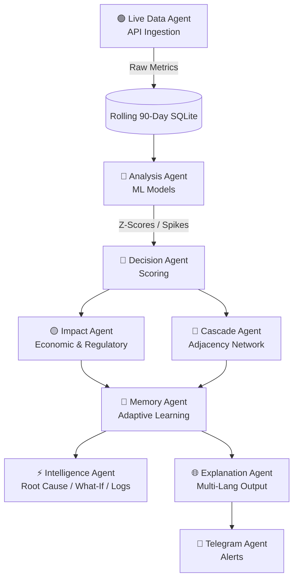

<div align="center">
  
  
  
  
  <h1>🌍 Airavat 3.0: Environmental Sentinel</h1>
  <p><b>A 10-Agent Cognitive Intelligence Engine for Real-Time Marine Crisis Detection & Decision Support.</b></p>
</div>

<br />

The **Environmental Sentinel** is not just a monitoring platform—it is a **proactive intelligence engine**. Designed specifically for India's massive coastal ecology (spanning zones like Mumbai, Goa, Kochi, Chennai, and the Andaman Islands), it autonomously fetches, interprets, tracks, and predicts marine and atmospheric anomalies. 

Instead of overwhelming administrators with raw data, it acts as an **expert analyst**, providing ready-to-use impact reviews, cascading risks, causal analysis, and economic damages calculated natively.

---

## 🌟 Executive Summary of Features

We have built a proprietary **10-Agent AI Architecture** designed exclusively around processing continuous geospatial and environmental data natively natively without user prompting.

### 🧠 1. Cognitive "100x Impact" Capabilities
*   **🧪 What-If Simulation Engine**: Allows policy-makers to simulate hypothetical scenarios (e.g., `"What happens to coastal zones if the Sea Surface Temperature rises by 1.5°C today?"`). The engine calculates downstream propagation risks and ecosystem shock thresholds.
*   **🧬 Root Cause AI**: Avoids the "Alert Fatigue" problem. Instead of just saying `"SST is High"`, the Root Cause Agent attributes mathematical probabilities (e.g., `"78% likelihood due to High Solar Isolation + Wind Nullification"`).
*   **⏰ Time-to-Risk Early Warning**: Uses rolling linear and holt-winters trend forecasting to calculate exactly *how long* (in hours/days) a specific zone has before a parameter breaches a non-recoverable critical limit.
*   **🧠 Pattern Memory System**: Retains past anomalies. When a new reading comes in, the Memory Agent fetches historical parallels, stating: *"Event structurally similar to Marine Heatwave recognized in March 2024; predicted severity: HIGH"*.
*   **🤖 Multi-Agent Transparency Logs**: Full access to the reasoning chain. Administrators can view the exact internal "conversation" passing between the Data Agent, the Analysis Agent, and the Decision Agent on the live server.

### ⚙️ 2. Core Operational Mechanics
*   **🌊 Live Open Data Ingestion**: Zero manual data entry. Autonomously fetches every 6 hours from:
    *   **NOAA CoastWatch ERDDAP** (Sea Surface Temperature & Chlorophyll-a).
    *   **Open-Meteo** (Wind & Surface Weather).
    *   **OpenAQ v2** (Air Quality / PM2.5 / PM10).
    *   **NASA EONET** (Satellinte-detected severe weather events).
*   **🧠 Rolling ML Re-training Window**: Keeps only 90 days of live memory. The models automatically prune stale data and recursively retrain (via *Isolation Forests* and *Seasonal-Trend Decompositions*) every 24 hours.
*   **💸 Socio-Economic Calculus**: Automatically models anomalies against fishing density grids to output exact economic risk impacts (e.g., `"₹124 Crore exposure, 4,500 local households affected"`).
*   **📝 Regulatory Compliance Autopilot**: Instantly formats anomalies into PDF-ready Incident Reports structured for India Coast Guard or INCOIS submission formats.
*   **🗣️ Vernacular Intelligence**: Automatically generates operator briefings in **10 Indian regional languages** (Hindi, Marathi, Tamil, Bengali, etc.), democratizing data for last-mile coastal workers.
*   **📱 Telegram Interoperability**: Bi-directional Telegram Bot API allowing agents to be paged across the field and remote querying of system health.

---

## 🏛️ System Architecture

The core philosophy of the system is absolute decoupling via **Specialized Agents**, mimicking the operation of a physical marine department.



---

## 🖥️ Hackathon Demo: Mission Control (Streamlit)
To demonstrate the full power of the AI pipeline to judges, we have included a **High-Fidelity Web Simulation Dashboard**. This web app bypasses steady-state monitoring and injects a realistic 48-hour marine heatwave crisis into the system, visualizing the multi-agent reasoning chain live.

### How to Run the Simulation:
```bash
# 1. Install dependencies
pip install -r requirements.txt

# 2. Launch the Mission Control Dashboard
python -m streamlit run simulation_app.py
```

**What the Judges Will See:**
1.  **🚨 Inject Anomaly**: A big red button to trigger a 48-hour crisis (SST spike, Wind stagnation, pH drop).
2.  **🧠 Reasoning Chain**: A live, scrollable feed showing exactly what each of the 10 agents is thinking.
3.  **📊 Visual Intelligence**: Real-time Plotly gauges for Risk Level and bar charts for Socio-Economic Impact (₹ Crore).
4.  **⏰ Early Warning**: Time-to-Risk calculates exactly when thresholds will hit "Non-Recoverable" levels.

---

## 🛠️ Installation & Deployment

This application operates primarily as a specialized Headless API, serving payloads capable of driving complex frontends.

### 1. Prerequisites
*   **Python:** `3.10+`
*   **OS:** Cross-platform (Windows, macOS, Linux)
*   **Memory:** 2GB RAM minimum (for the local scikit-learn training sequences)

### 2. Setup the Environment

```bash
# Clone repository
git clone <your-repository-url>
# On Windows:
venv\Scripts\activate
# On Mac/Linux:
source venv/bin/activate

# Install required dependencies
pip install -r requirements.txt
```

### 3. Environment Variables (`.env`)
You must create a `.env` file at `backend/.env`.

```env
# Required for Narrative Generation & Multi-language features
GEMINI_API_KEY=your_gemini_api_key

# Required for NASA severe event mapping
NASA_API_KEY=DEMO_KEY

# Optional: For remote operator access
TELEGRAM_BOT_TOKEN=your_bot_token_here
TELEGRAM_CHAT_ID=your_manager_chat_id

# Server Network properties
HOST=0.0.0.0
PORT=8000
```

### 4. Boot the Sentinel!

```bash
# Option 1: Start the Sentinel Server
python main.py

# Option 2: Start the Innovation Simulation (Streamlit)
python -m streamlit run simulation_app.py
```
*Note: On first startup, the Data Agent will immediately jump into a bootstrap cycle, fetching initial multi-API metrics and training the localized ML configurations for all 8 Indian coastline grids.*

---

## 📡 API Endpoints Guide

The system utilizes an automatically generated **Interactive Swagger Documentation Suite**.

Once booted, navigate to `http://localhost:8000/docs` to test any of the 30+ intelligence endpoints graphically.

### High Output Intelligence Endpoints

| Endpoint | Method | Purpose |
| :--- | :--- | :--- |
| `/api/simulate` | `POST` | The **What-If** parameter interface. Pass scenarios like high SST shifts. |
| `/api/rootcause/{zone_id}` | `GET` | Calculate algorithmic causal likelihoods based on parameter patterns. |
| `/api/time-to-risk/{zone_id}`| `GET` | Fetch rolling linear trend projections to threshold breaches. |
| `/api/agent-logs` | `GET` | View the hidden reasoning chain passing between internal workers. |
| `/api/impact` | `GET` | Retrieve the real-time socio-economic damage estimates. |
| `/api/incident/{alert_id}` | `GET` | Download a highly structured, submission-ready incident report. |
| `/api/briefing/{language}` | `GET` | Retrieve the localized executive summary. |

---

## 📊 Monitored Indian Coastal Zones

The Sentinel natively ships with boundaries optimized for 8 core regions:
1.  **Mumbai Coast** (Industrial & Heavy Port Traffic Ecosystems)
2.  **Goa Coast** (Tourism & High Boat Activity Density)
3.  **Kochi Coast** (Monsoon Vulnerability & Backwater Exchanges)
4.  **Chennai Coast** (High Salinity & Temperature Extremes)
5.  **Vizag Coast** (Deep water industrial impacts)
6.  **Sundarbans Delta** (Brackish, highly volatile multi-parameter ecological zones)
7.  **Gulf of Kutch** (Tidal flow anomalies)
8.  **Andaman Islands** (Pristine baseline for comparative coral stress tracking)

---

## 🧩 Advanced Extensibility & Roadmap

Because the system leverages a decoupled agent structure, extending capabilities is trivial.

**Upcoming Enhancements:**
*   `Frontend Layer`: Developing an interactive React / Leaflet JS dashboard to consume these specific APIs.
*   `Image-to-Risk Layer`: Allowing the system to analyze satellite raw optical bands via the Sentinel-2 integration platform.
*   `Expanded API Integrations`: Integrating native pH buoy ingestion directly from INCOIS IoT trackers instead of proxying via algorithm.

---

> **Built with precision and logic. Designed to protect tomorrow.** 🌍
