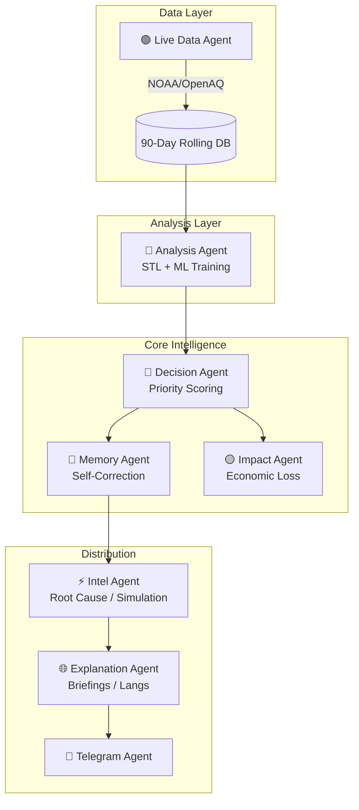

<div align="center">
  
  
  
  
  
  <h1>🌍 Airavat 3.0: Environmental Sentinel</h1>
  <p><b>An Autonomous 9-Agent Geospatial Intelligence Engine for Marine Crisis Lifecycle Management.</b></p>
</div>

---

## 🏆 Directly Addressing the Challenge Requirements

Our system is engineered to solve every core requirement of the **IEEE CS S.P.I.T Environmental Sentinel** problem statement:

### 1. Intelligent Anomaly Prioritization
*   **The Problem**: Threshold fatigue and manual comparison.
*   **Our Solution**: The **Decision Agent** uses a 4-dimensional scoring matrix: **Recency** (time-weighted decay), **Magnitude** (deviation from baseline), **Trajectory** (slope of change), and **Convergence** (multi-sensor agreement). Critical alerts are surfaced based on "Impact Probability" rather than raw numbers.

### 2. Temporal Pattern Modeling
*   **The Problem**: Hardcoded rules and late triggers.
*   **Our Solution**: The **Analysis Agent** performs **STL Decomposition** to strip seasonal rhythms from real-time noise. It feeds residuals into an **Isolation Forest** to detect baseline shifts and uses **Holt-Winters Projections** to provide probabilistic, horizon-bounded early warnings.

### 3. Adaptive Intelligence & Self-Correction
*   **The Problem**: Static models that don't learn from mistakes.
*   **Our Solution**: The **Memory Agent** maintains a region-specific sensitivity map. When an operator flags an alert as a "False Positive," the Memory Agent automatically recalibrates detection weights for that zone's specific signal (e.g., discounting chlorophyll noise in high-algae seasons).

### 4. Context-Aware Query Interface
*   **The Problem**: Overwhelming raw data dumps.
*   **Our Solution**: The **Explanation Agent** and **Intelligence Agent** synthesize all active telemetry into a reasoning chain. Operators can ask *"What needs attention right now?"* and receive a ranked summary describing historical drift, projected trajectory, and specific recommended actions.

### 5. Signal-Optimized Alerting
*   **The Problem**: Operator fatigue and redundant notifications.
*   **Our Solution**: Our **Multi-Agent Suppressor** prevents duplicate alerts. It only escalates when convergent evidence (e.g., Rising SST + Dropping Wind + NASA Event detection) crosses a meaningful threshold, delivering structured, action-oriented Incident Reports via **Telegram** and **API**.

---

## 🚀 "100x Impact" Additional Features
*   **🧪 What-If Simulations**: Inject hypothetical stressors (e.g., +2.0°C SST) to visualize cascading risks before they happen.
*   **🧬 Root Cause AI**: Probabilistic attribution of why an anomaly is occurring (e.g., "78% High Solar Insolation").
*   **💸 Economic Impact Engine**: Real-time modeling of damage in ₹ Crore based on Indian coastal fishing/shipping density.
*   **🌐 Vernacular Output**: Multi-language support (Hindi, Marathi, Tamil, etc.) for localized field response.
*   **📱 Telegram Command Center**: Bi-directional bot for remote querying and critical paging.

---

## 🏗️ The 9-Agent Architecture



---

## 🛠️ Installation & Setup

### 1. Environment Configuration
Create a `.env` in the `backend/` directory:
```env
GEMINI_API_KEY=your_key_here
TELEGRAM_BOT_TOKEN=your_token_here
TELEGRAM_CHAT_ID=your_id_here
HOST=0.0.0.0
PORT=8000
```

### 2. Launch the System
```bash
# Install dependencies
pip install -r requirements.txt

# Start the Intelligence Server
python main.py

# Launch the High-Fidelity Demo (Streamlit)
python -m streamlit run simulation_app.py
```

---

## 📡 API Mission Control
Once running, visit `http://localhost:8000/docs` to interact with our **30+ Intelligence Endpoints**. 

### Critical Endpoints:
*   `/api/simulate`: Interaction with the What-If Engine.
*   `/api/rootcause/{zone_id}`: AI-driven causal analysis.
*   `/api/briefing`: Situational executive summary.
*   `/api/agent-logs`: The "Internal Reasoning Chain" of the system.

---
> **Built for the IEEE CS S.P.I.T Challenge. Empowering Environmental Policy through Cognitive AI.** 🌍
